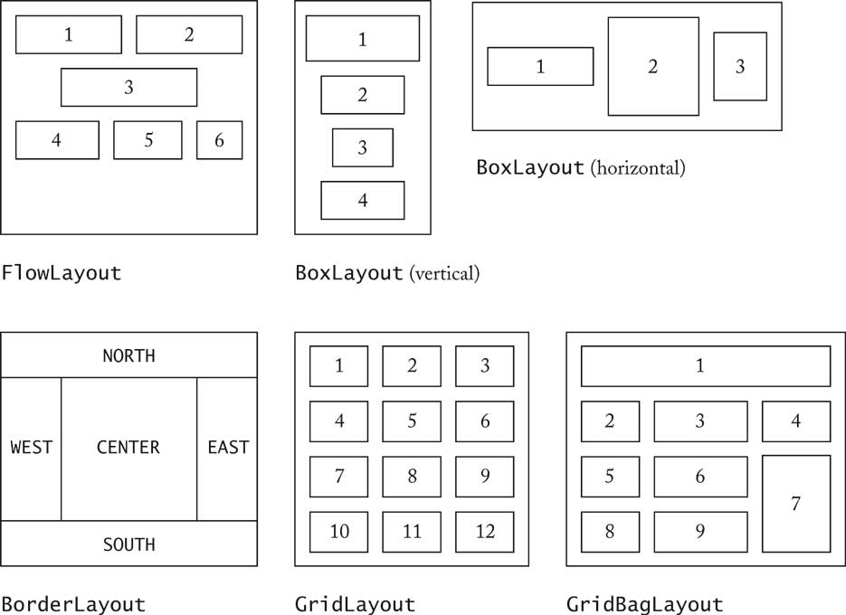
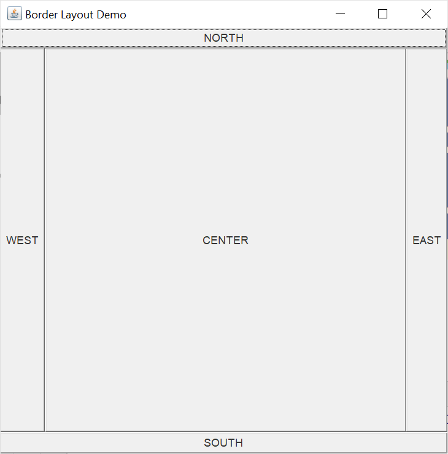
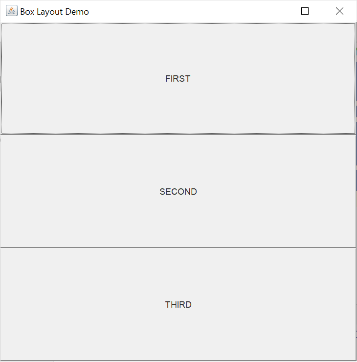

# 13. Пользовательский интерфейс Swing

## Методические указания

### Компоненты и контейнеры

_Компонент_ — это визуальный элемент управления (например, кнопка или поле ввода текста).

_Контейнер_ — это компонент, который может включать в себя несколько других компонентов (например, окно, панель).

**Иерархия компонентов Swing**


### Менеджеры компоновки

Менеджер компоновки управляет размещением компонентов в контейнере. Менеджеры компоновки являются экземплярами классов, реализующих интерфейс `LayoutManager`.

| **Менеджер**  | **Размещения компонентов**                     |
|----------------------|----------------------------------------------------------------|
|     FlowLayout       |     Слева направо и сверху вниз                                |
|     BorderLayout     |     По центру или по краям контейнера (принят по умолчанию)    |
|     GridLayout       |     В ячейках сетки, как в таблице                             |
|     GridBagLayout    |     В ячейках сетки с регулируемыми размерами                  |
|     BoxLayout        |     В вертикальном или горизонтальном направлении              |
|     SpringLayout     |     Располагает компоненты с учетом ограничений                |



Использование  `BorderLayout`.

```java
import javax.swing.*;
import java.awt.*;

public class DemoApp {
    public static void main(String[] args) {
        // Создать главнаю форму
        JFrame frame = new JFrame("Border Layout Demo");
        // Получить контент-панель
        Container pane = frame.getContentPane();
        
        pane.add(new Button("NORTH"), BorderLayout.NORTH);
        pane.add(new Button("CENTER"), BorderLayout.CENTER);
        pane.add(new Button("SOUTH"), BorderLayout.SOUTH);
        pane.add(new Button("WEST"), BorderLayout.WEST);
        pane.add(new Button("EAST"), BorderLayout.EAST);

        // Настроить главную форму
        frame.setSize(500, 500);
        frame.setDefaultCloseOperation(JFrame.EXIT_ON_CLOSE);

        // Показать главную форму
        frame.setVisible(true);
    }
}
```



Использование  BoxLayout.
```java
import javax.swing.*;
import java.awt.*;

public class DemoApp {
    public static void main(String[] args) {
        // Создать главнаю форму
        JFrame frame = new JFrame("Box Layout Demo");
        // Получить контент-панель
        Container pane = frame.getContentPane();
        // Создать менеджер компоновки и задать его контент-панели
        pane.setLayout(new BoxLayout(pane, BoxLayout.PAGE_AXIS));

        pane.add(new Button("FIRST"));
        pane.add(new Button("SECOND"));
        pane.add(new Button("THIRD"));
        
        // Настроить главную форму
        frame.setSize(500, 500);
        frame.setDefaultCloseOperation(JFrame.EXIT_ON_CLOSE);

        // Показать главную форму
        frame.setVisible(true);
    }
}
```



### Обработка событий

Модель обработки событий.


- Event Source — источник события (кнопка, меню, текстовое поле и пр.) 
- Event Object — событие (например, щелчок мыши, перемещение курсора и пр.), содержит полезную информацию, например, - координаты курсора.
- Listener — наблюдатель (слушатель) событий, выполняющий обработку событий, 
- Listener Interface — определяет тип наблюдателей, соответствующих некоторому типу событий.

Для того чтобы обрабатывать события некоторого типа, необходимо 
1. Создать слушатель событий — объект класса, реализующего логику реакции на событие (обработку события) за счёт переопределения абстрактных методов интерфейса типа Listener. 
2. Зарегистрировать созданного слушателя в источниках событий.
3. Когда источник события генерирует событие, он передает его всем зарегистрированным слушателям.
4. Вызванный слушатель получает объект события, сгенерированный источником, и выполняет обработку этого события.


Использование анонимных классов для реализации обработчиков событий.
```java
import javax.swing.*;
import java.awt.*;
import java.awt.event.ActionEvent;
import java.awt.event.ActionListener;

public class DemoApp {
    public static void main(String[] args) {
        // Создать главнаю форму
        JFrame frame = new JFrame("Box Layout Demo");
        // Получить контент-панель
        Container pane = frame.getContentPane();

        JButton button = new JButton("TEST");
        button.addActionListener(new ActionListener() {
            @Override
            public void actionPerformed(ActionEvent e) {
                // Обработка события
                JOptionPane.showMessageDialog(frame, "Hello World!");
            }
        });

        pane.add(button);

        // Настроить главную форму
        frame.setSize(500, 500);
        frame.setDefaultCloseOperation(JFrame.EXIT_ON_CLOSE);

        // Показать главную форму
        frame.setVisible(true);
    }
}
```

Использование собственных классов, реализующих интерфейс `ActionListener`.
```java
import javax.swing.*;
import java.awt.*;
import java.awt.event.ActionEvent;
import java.awt.event.ActionListener;

public class DemoApp {
    public static void main(String[] args) {
        // Создать главнаю форму
        JFrame frame = new JFrame("Box Layout Demo");
        // Получить контент-панель
        Container pane = frame.getContentPane();

        JButton button = new JButton("TEST");
        button.addActionListener(new MyActionListener(frame));

        pane.add(button);

        // Настроить главную форму
        frame.setSize(500, 500);
        frame.setDefaultCloseOperation(JFrame.EXIT_ON_CLOSE);

        // Показать главную форму
        frame.setVisible(true);
    }
}
```

```java
class MyActionListener implements ActionListener {
    Component comp;

    MyActionListener(Component comp) {
        this.comp = comp;
    }

    @Override
    public void actionPerformed(ActionEvent e) {
        // Обработка события
        JOptionPane.showMessageDialog(comp, "Hello World!");
    }
}
```

### Пример текстового редактора

```java
import javax.swing.*;
import java.awt.*;
import java.awt.print.PrinterException;
import java.io.*;
import java.awt.event.*;

class TextEditor extends JFrame implements ActionListener {
    JTextArea textArea; // Текстовая панель
    JFrame frame; // Главная форма

    TextEditor() {
        // Создать главнаю форму
        frame = new JFrame("My Lovely Text Editor");
        // Создать текстовую панель
        textArea = new JTextArea();

        // Создать строку меню
        JMenuBar menuBar = new JMenuBar();

        // Создать меню "Файл"
        JMenu m1 = new JMenu("Файл");

        // Создать пункты меню
        JMenuItem mi1 = new JMenuItem("Новый");
        JMenuItem mi2 = new JMenuItem("Открыть");
        JMenuItem mi3 = new JMenuItem("Сохранить");
        JMenuItem mi9 = new JMenuItem("Печать");

        // Добавить наблюдателя события каждому пункту меню
        mi1.addActionListener(this);
        mi2.addActionListener(this);
        mi3.addActionListener(this);
        mi9.addActionListener(this);

        // Добавить пункты меню в меню
        m1.add(mi1);
        m1.add(mi2);
        m1.add(mi3);
        m1.add(mi9);

        // Создать меню "Редактировать"
        JMenu m2 = new JMenu("Редактировать");

        // Создать пункты меню
        JMenuItem mi4 = new JMenuItem("Вырезать");
        JMenuItem mi5 = new JMenuItem("Копировать");
        JMenuItem mi6 = new JMenuItem("Вставить");

        // Добавить наблюдателя события каждому пункту меню
        mi4.addActionListener(this);
        mi5.addActionListener(this);
        mi6.addActionListener(this);

        // Добавить пункты меню в меню
        m2.add(mi4);
        m2.add(mi5);
        m2.add(mi6);

        // Добавить меню в строку меню
        menuBar.add(m1);
        menuBar.add(m2);

        // Настроить главную форму
        frame.setJMenuBar(menuBar);
        frame.add(textArea);
        frame.setSize(500, 500);
        frame.setDefaultCloseOperation(JFrame.EXIT_ON_CLOSE);

        // Показать главную форму
        frame.setVisible(true);
    }

    // Обработчик события
    public void actionPerformed(ActionEvent e) {
        String command = e.getActionCommand();

        switch (command) {
            case "Вырезать" :
                textArea.cut();
                break;
            case "Копировать" :
                textArea.copy();
                break;
            case "Вставить" :
                textArea.paste();
                break;
            case "Новый" :
                textArea.setText("");
                break;
            case "Открыть" :
                open();
                break;
            case "Сохранить" :
                save();
                break;
            case "Печать" :
                print();
                break;
        }
    }

    private void open() {
        // Создать диалог выбора файла
        JFileChooser fileChooser = new JFileChooser("f:");
        int state = fileChooser.showOpenDialog(null);

        // Если выбор файла в диалоговом окне прошел успешно
        if (state == JFileChooser.APPROVE_OPTION) {
            // Выбранный файл
            File file = fileChooser.getSelectedFile();

            try (FileReader fr = new FileReader(file); 
                        BufferedReader br = new BufferedReader(fr)) {
                String line;
                StringBuffer text = new StringBuffer();

                // Считать текст из файла
                while ((line = br.readLine()) != null)
                    text.append(line).append(System.lineSeparator());

                // Присвоить считанный текст текстовой области
                textArea.setText(text.toString());
            } catch (HeadlessException | IOException e) {
                showMessage(e.getMessage());
            }
        }
    }

    private void save() {
        // Создать диалог сохранения файла
        // Получить файл из диалога
        // Записать текст в выбранный файл
    }

    private void showMessage(String msg) {
        JOptionPane.showMessageDialog(frame, msg);
    }

    private void print() {
        try {
            textArea.print();
        } catch (PrinterException e) {
            showMessage(e.getMessage());
        }
    }

    // Main class
    public static void main(String args[]) {
        TextEditor e = new TextEditor();
    }
}
```

## Задание

_Можно выбрать и сделать только один вариант самостоятельно._

**Часть I**

_Вариант 1_: текстовый редактор без форматирования открытием/сохранением файлов в формат TXT.

_Вариант 2_: графический редактор с возможностью добавления графических фигур на полотно.

**Часть II**

_Вариант 1_: текстовый редактор с форматированием.

_Вариант 2_: графический редактор с drag&drop.

**Часть III**

_Вариант 1_: текстовый редактор с форматированием и открытием/сохранением файлов в формат HTML. Форматированный текст представлять с помощью [HTML тегов форматирования текста](https://www.w3schools.com/html/html_formatting.asp).

_Вариант 2_: графический редактор с drag&drop и сохранением файлов в графический формат.

## Вопросы

1.	Компоненты
2.	MVC
3.	Контейнеры
4.	Обработка событий

## Ресурсы

1. https://docs.oracle.com/javase/tutorial/uiswing/events
2. https://coderlessons.com/tutorials/java-tekhnologii/nauchitsia-kachatsia/swing-obrabotka-sobytii
