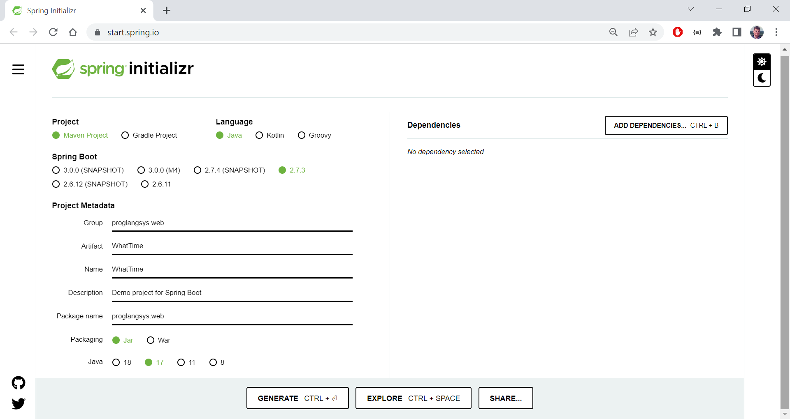
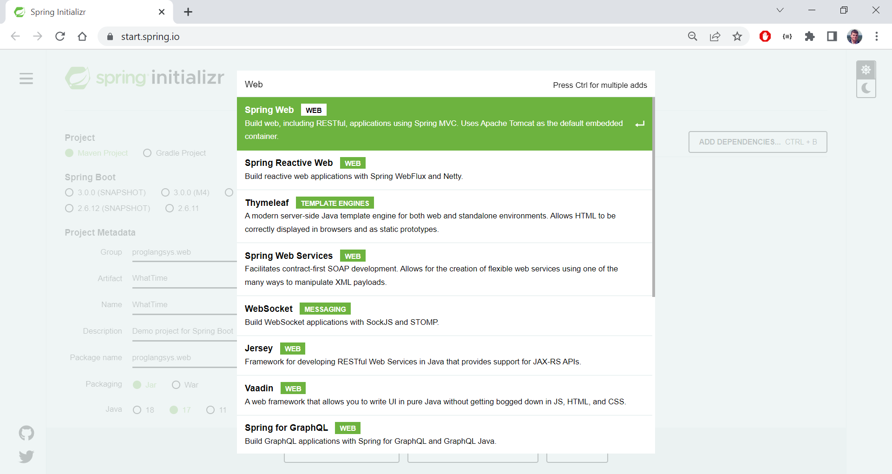
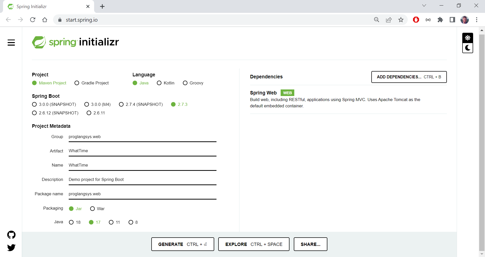
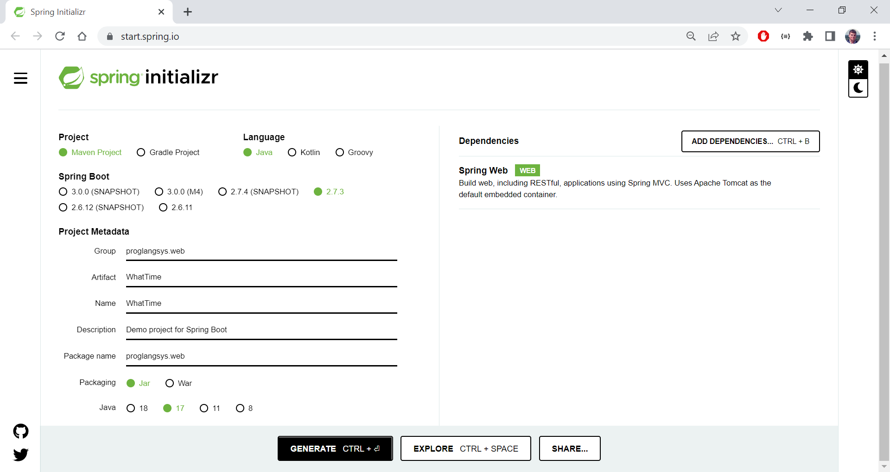
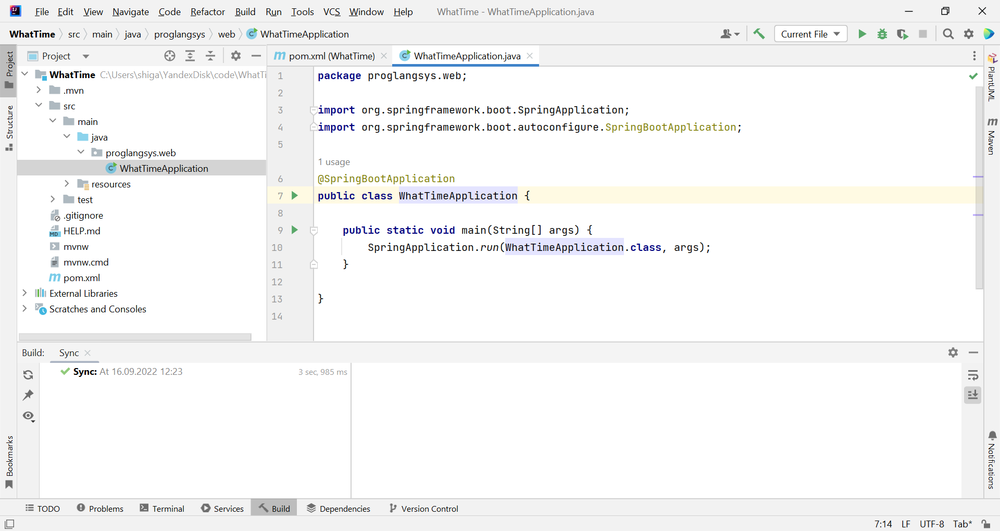

# 16. Веб-программирование (Spring)

## Методические указания

### Инструментальные средства

### Генерация стартового проекта Spring

Сгенерировать стартовый проект можно с помощью онлайн сервиса Spring Initializr — https://start.spring.io.
Указать следующие параметры проекта:
- Project: Maven Project
- Language: Java
- Project Metadata -> Group: "proglangsys.web"
- Artifact -> Group: WhatTime
- Name -> WhatTime
- Package name: "proglangsys.web"
- Packaging: JAR



Добавить зависимость (ADD DEPENDENCIES…) «Spring Web», введя в строке поиска «Web».



Добавленная зависимость отобразиться в списке «Dependencies» (справа).



Нажать кнопку GENERATE, чтобы сгенерировать проект.



Начнется загрузка архива с проектом.
Распаковать загруженный архив и открыть проект в IDE.



### POM-файл
```xml
<?xml version="1.0" encoding="UTF-8"?>
<project xmlns="http://maven.apache.org/POM/4.0.0" xmlns:xsi="http://www.w3.org/2001/XMLSchema-instance"
   xsi:schemaLocation="http://maven.apache.org/POM/4.0.0 https://maven.apache.org/xsd/maven-4.0.0.xsd">
   <modelVersion>4.0.0</modelVersion>
   <parent>
      <groupId>org.springframework.boot</groupId>
      <artifactId>spring-boot-starter-parent</artifactId>
      <version>2.7.3</version>
      <relativePath/> <!-- lookup parent from repository -->
   </parent>
   <groupId>proglangsys.web</groupId>
   <artifactId>WhatTime </artifactId>
   <version>0.0.1-SNAPSHOT</version>
   <name>WhatTime</name>
   <description>Demo project for Spring Boot</description>
   <properties>
      <java.version>17</java.version>
   </properties>
   <dependencies>
      <dependency>
         <groupId>org.springframework.boot</groupId>
         <artifactId>spring-boot-starter-web</artifactId>
      </dependency>

      <dependency>
         <groupId>org.springframework.boot</groupId>
         <artifactId>spring-boot-starter-test</artifactId>
         <scope>test</scope>
      </dependency>
   </dependencies>

   <build>
      <plugins>
         <plugin>
            <groupId>org.springframework.boot</groupId>
            <artifactId>spring-boot-maven-plugin</artifactId>
         </plugin>
      </plugins>
   </build>

</project>
```

#### Пример 1: Сервис запроса текущего времени

```java
package proglangsys.web;

import org.springframework.boot.SpringApplication;
import org.springframework.boot.autoconfigure.SpringBootApplication;
import org.springframework.web.bind.annotation.GetMapping;
import org.springframework.web.bind.annotation.RequestParam;
import org.springframework.web.bind.annotation.RestController;

import java.text.DateFormat;
import java.text.SimpleDateFormat;
import java.util.Date;

@SpringBootApplication
@RestController
public class WhatTimeApplication {

   public static void main(String[] args) {
      SpringApplication.run(WhatTimeApplication.class, args);
   }

   @GetMapping("/whatTime")
   public String whatTime() {
      DateFormat dateFormat = new SimpleDateFormat("yyyy/MM/dd HH:mm:ss");
      Date date = new Date();
      return dateFormat.format(date);
   }

}
```

### Пример 2: конвертер футов в метры (REST)

```java
package proglangsys.web;

import org.springframework.boot.SpringApplication;
import org.springframework.boot.autoconfigure.SpringBootApplication;
import org.springframework.web.bind.annotation.GetMapping;
import org.springframework.web.bind.annotation.RequestParam;
import org.springframework.web.bind.annotation.RestController;

@SpringBootApplication
@RestController
public class MetricConvApp {

   public static void main(String[] args) {
      SpringApplication.run(MetricConvApp.class, args);
   }

   @GetMapping("/feet2meter")
   public String feet2meter(@RequestParam(value = "feet") double feet) {
      double meter = feet/3.28084;
      return String.format("%s feet = %s meter", feet, meter);
   }

}
```

### Пример 3: Конвертер футов в метры с пользовательским веб-интерфейсом.

Класс объектов обмена данными.
```java
package proglangsys.web;

public class Conv {
    private double val;
    private double result;

    public double getVal() {
        return val;
    }

    public void setVal(double val) {
        this.val = val;
    }

    public double getResult() {
        return result;
    }

    public void setResult(double result) {
        this.result = result;
    }
}
```

Шаблон HTML-формы отправки данных
```html
<!DOCTYPE HTML>
<html xmlns:th="https://www.thymeleaf.org">
<head>
    <title>Metric Conversion</title>
    <meta http-equiv="Content-Type" content="text/html; charset=UTF-8" />
</head>
<body>
<h1>Feet to Meter Conversion</h1>
<form action="#" th:action="@{/conv}" th:object="${conv}" method="post">
    <p>Feet: <input type="text" th:field="*{val}" /></p>
    <p><input type="submit" value="Submit" /> <input type="reset" value="Reset" /></p>
</form>
</body>
</html>
```

Шаблон HTML-страницы результатов обработки
```html
<!DOCTYPE HTML>
<html xmlns:th="https://www.thymeleaf.org">
<head>
  <title>Metric Conversion</title>
  <meta http-equiv="Content-Type" content="text/html; charset=UTF-8" />
</head>
<body>
<h1>Result</h1>
<p th:text="'Feet: ' + ${conv.val}" />
<p th:text="'Meter: ' + ${conv.result}" />
<a href="/conv">Convert another value</a>
</body>
</html>
```

Контроллер (обрабатывает запросы)
```java
package proglangsys.web;

import org.springframework.stereotype.Controller;
import org.springframework.ui.Model;
import org.springframework.web.bind.annotation.GetMapping;
import org.springframework.web.bind.annotation.ModelAttribute;
import org.springframework.web.bind.annotation.PostMapping;

@Controller
public class ConvController {

    @GetMapping("/conv")
    public String convForm(Model model) {
        model.addAttribute("conv", new Conv());
        return "conv";
    }

    @PostMapping("/conv")
    public String convSubmit(@ModelAttribute Conv conv, Model model) {
        String val = conv.getVal();
        double feet = Double.parseDouble(val);
        double meter = feet / 3.28084;
        conv.setResult(Double.toString(meter));

        model.addAttribute("conv", conv);
        return "result";
    }

}
```

Веб-приложение
```java
package proglangsys.web;

import org.springframework.boot.SpringApplication;
import org.springframework.boot.autoconfigure.SpringBootApplication;

@SpringBootApplication
public class MetricConvApplication {

   public static void main(String[] args) {
      SpringApplication.run(MetricConvApplication.class, args);
   }

}
```

## Задание


**Часть I**

- Разработать веб-сервис определения текущего времени.

**Часть II**

- Разработать веб-сервис конвертирования фунтов в килограммы.


**Часть III**

- Разработать веб-приложение конвертирования фунтов в килограммы с пользовательским веб-интерфейсом.

## Вопросы


## Ресурсы
